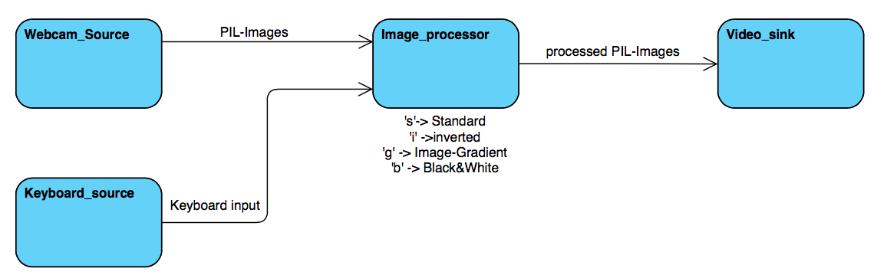

# Webcam_pipeline_example

This example uses a pipeline with a `webcam_source`, `keyboard_source`, `video_sink` and a custom made `image_processor`.

The `webcam_source` sends images from the webcam to the `image_processor`. 

The `keyboard_source` sends key-presses to the `image_processor`.

The `image_processor` collects key-presses and images from the two sources.
It has 4 different modes:

    - Standard (s) [also the default mode]
    - Gradient (g)
    - Black & White (b)
    - Inverted (s)
    
The modes can be changed by pressing the corresponding key (e.g: i -> inverted).
Images which arrive will be processed depending on the mode.
The processed images will be send to the `video_sink`.
 
The `video_sink` collects the images from the `image_processor` and will save them to a video when the pipeline 
is stopped.

